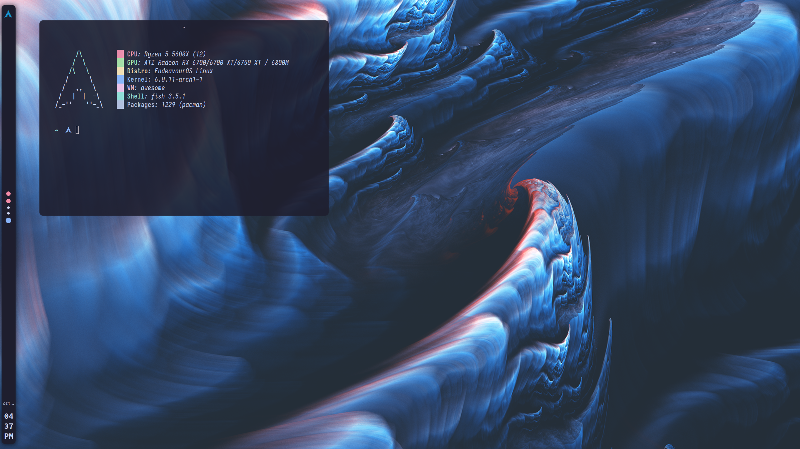
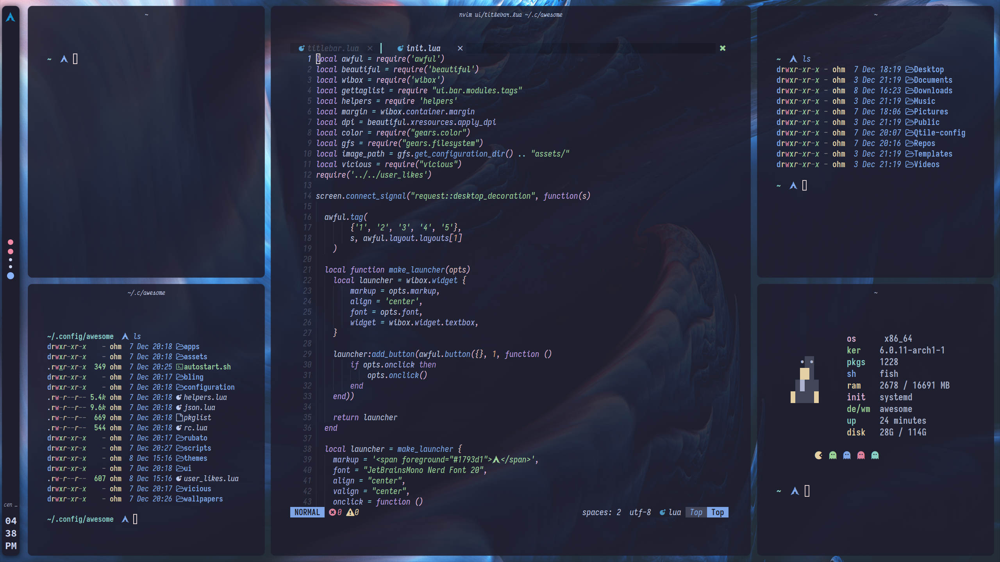

<h1 align="center">Aesthetic Awesome Setup</h1>

<h3 align="center">If you decide to use my config, please do give me credit in the README of your fork/repo.</center>

### Rice
</img>
<br>
### Workflow
</img>

# Install
<details>
  </br>

### You need to install a AUR manager of some sort (yay, paru, etc)
# Dependencies
```yay -Syu $(cat pkglist)```


# Install
```cd Aesthetic-Awesome && cp -rf config/ ~/.config/ && mv ~/.config/nvim ~/.config/ && sudo systemctl enable --now sddm```

In order to use the SDDM theme, you will have to edit the SDDM config file as shown below.
```
### FOR ARCH LINUX
sudo nvim /usr/lib/sddm/sddm.conf.d/default.conf
###
```
Set 
```
[THEME]
Current=
```

to 
```
[THEME]
Current=multicolor-sddm-theme
```
</details>

# **NOTE**
### Wallpapers Repo needs to be fixed first<br>I have provided a few in this repo located in the ```config/awesome/wallpapers/``` directory
~~### I have moved the wallpapers to another repo due to its large file size (12gb because they have been upscaled to 4K using <a href="https://github.com/upscayl/upscayl">Upscayl</a>). If you want those wallpapers, run the commands below:~~
```
git clone https://github.com/Spaxly/Wallpapers
mv Wallpapers/wallpapers/ ~/.config/Aesthetic-Awesome/
```

**It is recommended to reboot after executing the commands above.**

# Features
- Workspace icons animated using Rubato
- Various Layouts
- Minimal Vertical Bar

# Credits

<a href="https://github.com/AlphaTechnolog">AlphaTechnolog</a> - I used his helpers.lua and added on to the tags.lua 
<br>
<a href="https://github.com/adi1090x">adi1090x</a> - I used his rofi themes
